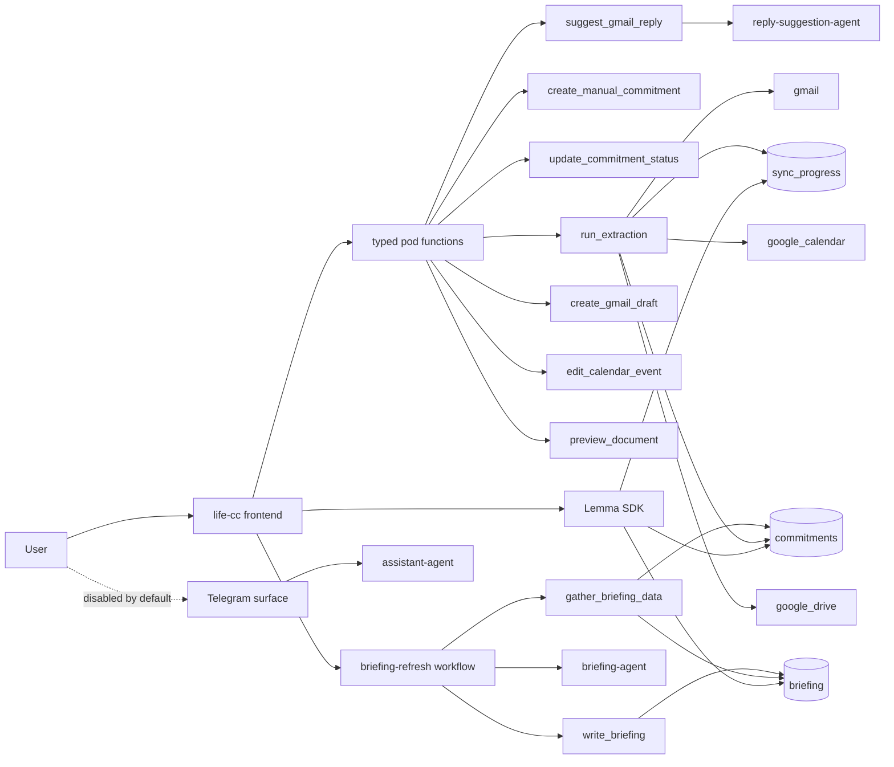

# Life Command Centre Architecture

This document describes the code in this checkout today.

Important deployment note:

- The checked-in bundle has already moved to the hardened function-backed design.
- The currently running Lemma pod may still lag behind until the updated bundle is imported and published.

## Runtime Shape

There are two codebase halves:

- `life-cc/`: the React frontend app.
- `pod/`: the Lemma pod bundle with tables, functions, agents, workflows, schedules, and surfaces.

## Current Design Rules

- Product writes are function-backed, not shell-backed.
- `assistant-agent` is read-only in the checked-in bundle.
- Gmail suggestion is the only LLM-assisted action path, and it uses reduced structured context.
- Extraction and document preview are deterministic.
- Briefing refresh is watermark-gated so the LLM is skipped when nothing changed.
- Telegram is present as a surface manifest but disabled in the bundle until it can ride the same safe path.

## Frontend Map

### App shell

- `life-cc/src/main.tsx`
  - Boots the app, auth guard, React Query, router, `CommitmentsProvider`, and `BriefingProvider`.
- `life-cc/src/Layout.tsx`
  - Shared sidebar, route title, partial-data messaging, and global `SyncButton`.

### Shared state

- `life-cc/src/CommitmentsContext.tsx`
  - Maintains two live feeds:
  - open commitments, capped at `500`
  - snoozed commitments, capped at `200`
- `life-cc/src/BriefingContext.tsx`
  - Reads the latest saved briefing row and triggers manual briefing refresh.
  - Auto-refresh is runtime opt-in via `VITE_ENABLE_BRIEFING_AUTO_REFRESH`.
- `life-cc/src/useSyncProgress.ts`
  - Subscribes to `sync_progress` rows for one `sync_run_id`.

### Views and action entry points

- `life-cc/src/Dashboard.tsx`
  - KPI cards, briefing card, partial-state warning, and quick-add via `create_manual_commitment`.
- `life-cc/src/CategoryView.tsx`
  - Category and snoozed views over the shared commitments feed.
- `life-cc/src/CommitmentItem.tsx`
  - Done, snooze, and unsnooze via `update_commitment_status`.
- `life-cc/src/actions/ReplyPanel.tsx`
  - `suggest_gmail_reply` builds a compact prompt, then `reply-suggestion-agent` drafts text, then `create_gmail_draft` commits the draft.
- `life-cc/src/actions/EditEventForm.tsx`
  - Direct calendar mutation through `edit_calendar_event`.
- `life-cc/src/actions/DocViewer.tsx`
  - Deterministic document preview through `preview_document`.
- `life-cc/src/AskAi.tsx`
  - Read-only local Q&A over already-loaded commitments.

## Pod Map

### Tables

- `pod/tables/commitments/commitments.json`
  - Main queue of manual and extracted commitments.
- `pod/tables/sync_progress/sync_progress.json`
  - Per-source sync rows with `pending | running | done | skipped | failed` and `error_message`.
- `pod/tables/briefing/briefing.json`
  - One saved briefing row per `briefing_date` via a unique constraint.

### Functions

- `pod/functions/create_manual_commitment/`
  - Canonical manual quick-add path.
- `pod/functions/update_commitment_status/`
  - Canonical done, snooze, unsnooze path.
- `pod/functions/suggest_gmail_reply/`
  - Fetches and sanitizes Gmail context before any agent step.
- `pod/functions/create_gmail_draft/`
  - Deterministic Gmail draft creation.
- `pod/functions/edit_calendar_event/`
  - Deterministic calendar edit.
- `pod/functions/preview_document/`
  - Deterministic document fetch/format path.
- `pod/functions/run_extraction/`
  - Safe extraction wrapper that initializes truthful sync rows, then runs the shared engine.
- `pod/functions/gather_briefing_data/`
  - Performs the pre-gate and prepares capped structured briefing input.
- `pod/functions/write_briefing/`
  - Atomic persistence of the daily briefing row.
- `pod/functions/extract_commitments/`
  - Kept as a legacy artifact in the repo, but no longer the intended product-facing contract.

### Agents

- `pod/agents/assistant-agent/`
  - Read-only conversational surface in the hardened bundle.
- `pod/agents/reply-suggestion-agent/`
  - No-tool agent that turns reduced Gmail context into suggested reply text.
- `pod/agents/briefing-agent/`
  - Read-only writer of briefing prose from prepared structured input.
- `pod/agents/action-agent/`
  - Deprecated migration artifact retained locally, not intended for active product flows.

### Workflows and schedules

- `pod/workflows/extraction-run/`
  - Workflow wrapper around `run_extraction`.
- `pod/workflows/gmail-intake/`
  - Gmail-triggered workflow that also calls `run_extraction`.
- `pod/workflows/briefing-refresh/`
  - `gather_briefing_data -> decision -> briefing-agent -> write_briefing`.
- `pod/schedules/extraction-sweep/`
  - Optional time-based extraction trigger.
- `pod/schedules/briefing-refresh/`
  - Optional time-based briefing refresh trigger.
- `pod/schedules/gmail-trigger/`
  - Webhook schedule for inbound Gmail-triggered ingestion.
- `pod/surfaces/telegram/telegram.json`
  - Telegram surface manifest with `is_enabled: false` in the checked-in bundle.

## Cost-Control Architecture

- No shell-backed product action path is part of the intended checked-in design.
- No document preview path calls an LLM.
- No calendar edit or Gmail draft creation path calls an LLM.
- Reply suggestion sends only reduced context, not full raw message bodies or attachments.
- Briefing generation is bounded before the agent step and skipped entirely when nothing changed.
- The app reuses live table reads for Q&A instead of launching an LLM by default.
